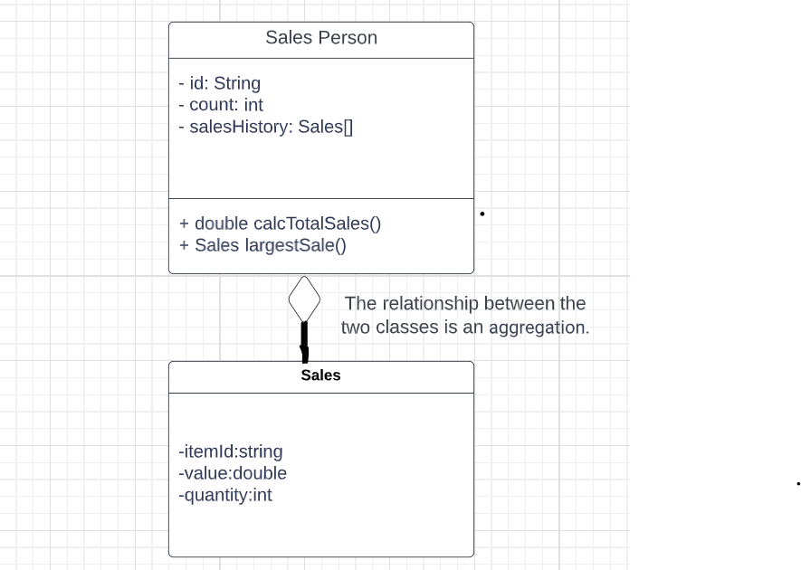
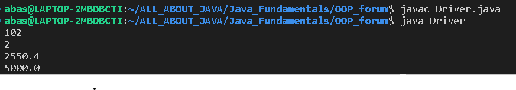

# OOP_Forum_Task

# 1.(a) By making use of an example from the above scenario, distinguish between a class and an instantiation of a class. (3 points) 
* A class in OOP is a blueprint used to specify the characteristics of a certain type of object.
--Instantiation is the process of creating an instance or object-based class. The instance has its own set of data and state, representing a particular occurrence .
* Example, consider the "Product" is the name of the class and represents the various products that can be sold by a business. The  class ‘product’ can have property specifications/definitions such as  "name," "price," and "quantity." Or even methods like, "calculateTotalPrice" and "updateQuantity."
Instant object of the product could be: "Mobile Phone," an instance or object of the "Product" class is produced. The information in this case would be distinct, such as the name "Mobile Phone," so this instance represents a particular occurrence.
Public class Product{
String name;
Double price
}
Example of instantiation in java syntax:
Product mobilephone=new product().

# 1.(b)The different modules in the program each open a graphical user interface (GUI). Each GUI has a similar design but contains differences specific to each module.By giving two examples, explain how the principles of inheritance can be incorporated into the design of this administration program. (4 points)

* Example1:
inheritance might be used to extend particular attributes of the parent GUI class to other UI classes. Each UI class can have their own attributes but might share common attributes defined in parent class as class(s) can access such attributes through extension from the parent class.
* Example2:
 Consider the ‘Product’ class as a superclass/parent class with common attributes of ‘name’ and ‘price’. There could be many subclasses that inherit from the ‘product’ class…such as ‘Book’ which inherits the attributes of name and price, and can have its unique attribute as well like ‘genre’. Also, you can override for example, a method called displayinfo() defined in the parent class. And add ‘super.displaying()’ in the overridden method and proceed.
You can have another subclass like, “MobilePhones” and extend the ‘product’ class and follow the same procedure as the ‘Book’ class.

# 1(c) Describe how the use of libraries can facilitate the development of programs like this company’s administration program. (3 points).

* Libraries have in-built functions that can save time instead of manually coding constructing methods, and this is time saving for the programmer. Also, it is more likely to make mistakes or run into bugs if you hard code, while on the other hand, libraries might be free of bugs and give the company's admin program more possibilities.

# 2(a).Explain why accessor methods are necessary for the SalesPerson class. (3 points)

* The variables are declared private and in order to access those variable accessor methods like getmethod() or setmethod() are necessary so that the variables can be accessed outside the class.

# Construct unified modelling language (UML) diagrams to clearly show the relationship between the SalesPerson and Sales classes.

# Outline a negative effect that a future change in the design of the Sales object might have on this suite of programs. (2 points)

* The Sales class is used in the  SalesPerson class, and any changes made in the Sales class will affect the SalesPerson class. For example, the method: calcTotalSales()in the  SalesPerson class fully depends on the Sales as it calculates the total sales which uses the method, getValue() and getQuantity() from the Sales class.

# Suggest changes that must be made to the SalesPerson class and or the Sales class to allow these calculations to be made. (3 points)
* In order to make the calculations monthly, annually or daily,  a date variable could be added in the Sales class. Since the date variable could be private, setters and getters for the variable will be required so that they can be accessed in the caltotal() method.

# Discuss the use of polymorphism that occurs in this suite of programs. (3 points)

* Overloading method has been used which is a polymorphism. The two constructors in the Sales Person class:  public SalesPerson(String id)and public SalesPerson(String id, Sales[] s, int c). The constructors have the same names but have different parameters, therefore, they will behave differently.
# State the output after running this code. (4 points)
